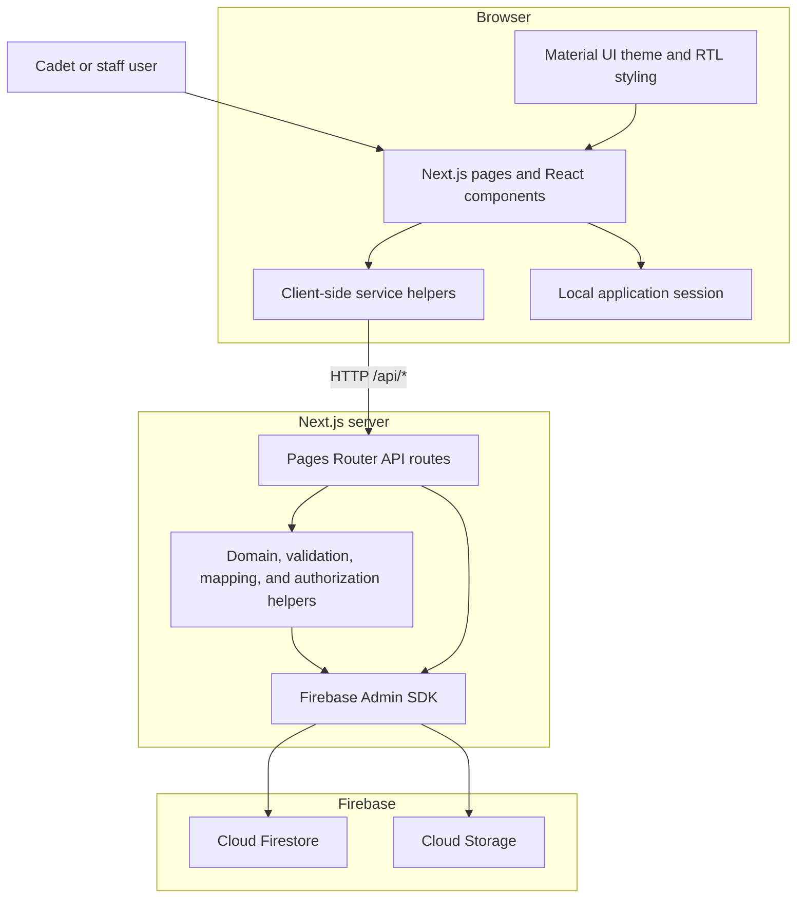
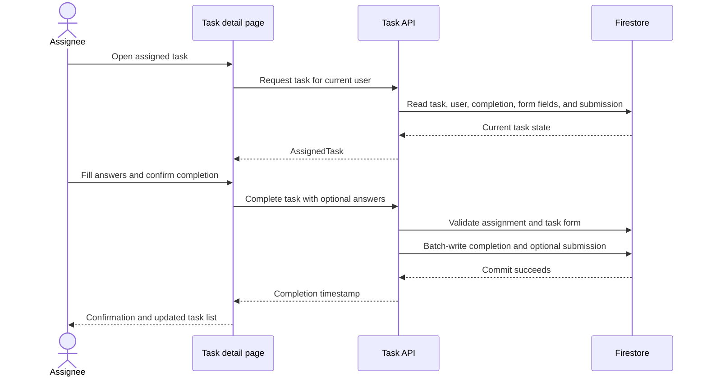
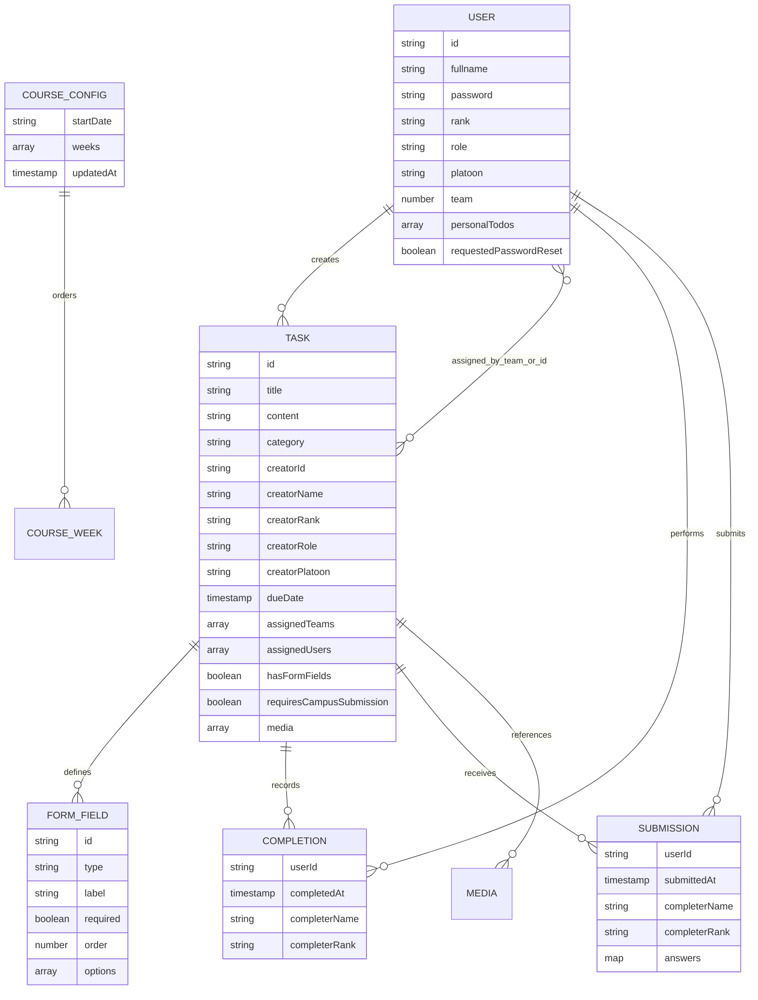

# All In One — Architecture Guide

## 1. System overview

All In One is a mobile-oriented, Hebrew, right-to-left task-management application for cadets and training staff. Cadets use it to see assigned work, submit task forms, mark tasks complete, view the course calendar, and maintain a private todo list. Users with management roles can create tasks, assign them to teams or individuals, and track completion and submission status.

The application is a single Next.js codebase. It contains:

- a React 19 browser UI;
- Next.js 16 Pages Router pages;
- Next.js API routes that form the server-side application layer;
- Firebase Admin integrations for Firestore and Cloud Storage;
- shared TypeScript types and domain helpers used across the UI and API layers.



The browser does not embed the main data-access logic in page components. Pages call small modules under `src/lib`, such as `fetchAssignedTasks`, `createTask`, or `completeTask`. Those modules issue requests to `/api/*`. API handlers then validate input, apply role and assignment rules, and read or update Firebase.

## 2. Technology and presentation layer

### Application framework

- **Next.js 16.2.9** provides the Pages Router, API routes, server rendering, and build/runtime tooling.
- **React 19.2.4** provides the component model and client-side state.
- **TypeScript** is configured in strict, no-emit mode with the `@/*` alias mapped to `src/*`.
- The application is run with the standard `next dev`, `next build`, and `next start` commands.

### UI and RTL support

The UI uses Material UI 9, Emotion, Material Icons, and an application theme defined in `src/theme.ts`. Global app setup is handled by `src/pages/_app.tsx` and document-level markup by `src/pages/_document.tsx`.

The interface is designed for Hebrew:

- the layout and styling use right-to-left direction;
- `src/lib/rtlCache.ts` configures Emotion/stylis RTL processing;
- shared layout and navigation live in `AppLayout`, `AppBottomBar`, profile components, and the global theme;
- most content pages use compact Material UI containers suitable for mobile screens.

`next.config.ts` bundles Pages Router dependencies to keep Emotion instances consistent during server rendering. Firebase Admin and its native/transitive packages are listed as server externals.

## 3. Repository organization

| Area | Responsibility |
| --- | --- |
| `src/pages` | Browser pages and Next.js API routes |
| `src/components` | Reusable layout, task, form, profile, calendar, administration, and reporting UI |
| `src/lib` | Client API wrappers, Firebase initialization, domain rules, validation, mapping, CSV/reporting, storage, and utility functions |
| `src/types` | Shared user, task, form, report, and course-configuration contracts |
| `src/styles` | Global and page-specific CSS |
| `public` | Branding, favicon, and course-week banner images |

### Important UI modules

- `AppLayout` and `AppBottomBar` provide the authenticated application shell.
- `TaskCard` and `CreatedTaskCard` present assigned and managed tasks.
- `TaskForm` combines assignment, category, due-date, custom-form, and media controls for task creation and editing.
- `TaskAssigneePicker` supports team and direct-user assignment.
- `TaskFormFieldBuilder` and `TaskFormRenderer` define and render task-specific questionnaires.
- `TaskCompletionsDialog` and `TaskSubmissionsDialog` present management status.
- `MonthCalendar` presents tasks by date.
- `PersonalTodoList` manages user-owned todo items.
- Reporting components and helpers create shareable task-status images and submission CSV data.

### Important domain modules

- `roles.ts` defines role identifiers, Hebrew labels, task-management access, and supervisor/subordinate relationships.
- `assigneeTeams.ts` normalizes team and user assignments and resolves users covered by an assignment.
- `taskManagementAuth.ts` applies management visibility rules.
- `taskMapper.ts` converts Firestore task records into public application objects.
- `taskFormFirestore.ts` reads and writes form fields and submissions.
- `taskFormValidation.ts` validates required fields and option values.
- `taskMediaStorage.ts` manages task files in Firebase Storage.
- `authStorage.ts` maintains the current browser session.
- `firebaseAdmin.ts` lazily initializes the server-side Firebase Admin application.

## 4. Browser routes and user experience

| Route | Purpose |
| --- | --- |
| `/` | Login, first-login password setup, and password-reset request |
| `/allTasks` | Main assigned-task view and profile drawer entry point |
| `/tasks/[taskId]` | Task details, task form, attachments, completion, and sharing |
| `/calendar` | Calendar view of relevant tasks |
| `/todo` | Personal todo list |
| `/mytasks` | Tasks created by the user and tasks visible through the management hierarchy |
| `/mytasks/new` | New-task workflow for roles that can manage tasks |
| `/profile` | Redirects to the profile view within `/allTasks` |
| `/admin` | Administrative dashboard and course configuration |
| `/admin/users` | User search, creation, editing, deletion, and status management |

Authenticated pages read the saved session through `getSession()`. If no session is present, they redirect to `/`. Role-sensitive pages additionally check whether the current role can manage tasks or access administration before rendering their content.

## 5. API organization

The API is implemented entirely with Pages Router handlers under `src/pages/api`.

### Identity and password flows

- `/api/login`
- `/api/set-password`
- `/api/request-password-reset`

These routes load user documents, compare or initialize passwords, set password-reset request state, and return public user objects without the stored password.

### Task flows

- `/api/tasks`
- `/api/tasks/assigned`
- `/api/tasks/calendar`
- `/api/tasks/created`
- `/api/tasks/subordinate`
- `/api/tasks/[taskId]`
- `/api/tasks/[taskId]/complete`
- `/api/tasks/[taskId]/completions`
- `/api/tasks/[taskId]/submissions`
- `/api/tasks/[taskId]/media`
- `/api/tasks/[taskId]/media/[mediaId]`

Together these routes provide task creation, listing, detail retrieval, editing, deletion, completion state, form submissions, management status, and file attachment operations.

### User and administration flows

- `/api/users/search`
- `/api/users/by-ids`
- `/api/users/by-teams`
- `/api/users/personal-todos`
- `/api/admin/users`
- `/api/admin/users/[userId]`
- `/api/admin/users/import`
- `/api/admin/users/export`
- `/api/course-config`
- `/api/admin/course-config`

The general user routes support assignee lookup and personal todos. Administrative routes provide user CRUD operations, CSV import/export, and course-week configuration.

Client-side modules under `src/lib` mirror these capabilities. For example, `fetchAssignedTasks.ts`, `fetchTask.ts`, `createTask.ts`, and `savePersonalTodos.ts` isolate request construction and response typing from page components.

## 6. Core application flows

### Login and session restoration

1. The login page posts an ID and password to `/api/login`.
2. The API reads the matching Firestore user.
3. A user without an initialized password is directed into the first-login password flow.
4. A successful response returns a `PublicUser`.
5. The browser stores the application session and redirects to `/allTasks`.
6. On a later visit, the login page uses the stored credentials to restore the session before redirecting.
7. A password-reset request sets `requestedPasswordReset` on the user's Firestore document; administrators can see that state in user management.

### Viewing assigned tasks

1. `/allTasks` loads the current browser session.
2. The page calls the assigned-task API with the user's identity.
3. The server loads the user's team and queries tasks assigned either to that numeric team or directly to the user's ID.
4. The results are merged and de-duplicated.
5. Each task is enriched with the user's completion record and optional submission.
6. The page filters and presents pending, completed, or all tasks.
7. Selecting a task opens `/tasks/[taskId]`.

### Creating and assigning a task

1. A non-cadet role opens `/mytasks/new`.
2. `TaskForm` collects the task content, category, due date, team assignments, direct-user assignments, optional form fields, and optional campus-submission flag.
3. The page posts the task to `/api/tasks`.
4. The server loads the creator, snapshots creator details into the task, validates assignment and form data, and creates the Firestore task.
5. Custom fields are written to the task's `formFields` subcollection.
6. Selected media files are uploaded separately after the task is created.
7. The UI redirects to the new task's detail page.

Assignments are stored in two complementary forms:

- `assignedTeams`: numeric team IDs, grouped by platoon in the UI;
- `assignedUsers`: individual user document IDs.

A user is an assignee when either their team is selected or their ID appears in the direct-user list.

### Completing a task and submitting a form



Task forms support:

- free text;
- single-choice questions;
- multi-select questions;
- required and optional fields;
- ordered display;
- optional answer choices where appropriate.

Completing a task creates a per-user completion document. When form fields exist, the same operation also writes a per-user submission document containing the answers. Undoing completion removes the user's completion state and associated submission state.

### Management and reporting

`/mytasks` combines tasks created by the current user with tasks visible through the role hierarchy. Managers can:

- inspect the full assignee list;
- see who has and has not completed a task;
- inspect submitted answers;
- edit or delete their own tasks;
- export or format submission information;
- generate and share a visual task-status report.

Task report images are rendered in the browser and passed to the platform share capability when supported, with download as the alternate result.

### Calendar

The calendar API loads tasks relevant to the current user. It combines assigned-task information with creator/management information as applicable and attaches completion state. `MonthCalendar` groups those normalized calendar tasks by date for display.

### Personal todos

Personal todos are separate from assigned tasks. The `/todo` page reads and writes the `personalTodos` array on the current user's Firestore document.

Each item includes:

- an ID;
- text;
- an optional description;
- an optional due date;
- completion state;
- creation time.

The UI performs optimistic add, edit, toggle, delete, undo-delete, and clear-completed operations, then persists the complete normalized list through `/api/users/personal-todos`.

### Administration

Administrative access is available to configured developer/innovation roles and to the optional environment-configured administrator ID.

The administrative UI provides:

- user listing and search;
- user creation, editing, and deletion;
- password initialization/reset state;
- CSV user import and export;
- course start-date and week-sequence configuration.

The public course-config endpoint expands stored week IDs through the local week catalog so the browser receives week names and banner-image paths.

## 7. Roles and management hierarchy

`src/lib/roles.ts` is the central role catalog. Each internal role identifier maps to a Hebrew display label.

### Role groups

- `peasant` — **צוער**; uses assigned tasks and personal features.
- `commander` — **סגל ההכשרה**.
- `developer` — **מפתח All In One**.
- Battalion roles cover innovation, digital, AI, administration, logistics, sports, and instruction.
- Platoon roles cover medicine, safety, education, instruction, logistics, sports, operations, simulations, and training.
- Team and command roles include **סמ"פ**, **ממ"ש**, team instruction, and team simulation.

All roles except `peasant` can enter the task-management workflow. Administration is a narrower capability determined by `canAccessAdmin`.

### Hierarchical visibility

The explicit one-level supervisor mapping is:

- battalion instruction → platoon instruction;
- battalion sports → platoon sports;
- battalion logistics → platoon logistics;
- platoon instruction → team instruction;
- platoon simulation → team simulation.

A management user can view a task-management record when one of these conditions applies:

1. the user created the task;
2. the task is assigned to the user's team or directly to the user;
3. the task creator has the role directly below the viewer in the configured hierarchy and belongs to the same organizational domain.

Battalion-level matching spans platoons. Platoon-level matching is constrained to the viewer's platoon, derived from the user's team.

## 8. Firebase data model

The application uses Firestore documents for primary records and task subcollections for per-task relational data.



### `users`

The user document ID is the application user ID. The document stores identity and organizational fields, the role, password state, optional personal todos, and optional password-reset request state.

API responses map stored users to `PublicUser` objects containing only the fields needed by the UI.

### `tasks`

Each task contains its content, category, due date, assignments, and a snapshot of the creator's display and organizational information. Snapshotting the creator fields allows task cards and reports to display creator information without a separate lookup.

`hasFormFields` indicates whether the task has custom questions. `requiresCampusSubmission` records an additional task requirement. The `media` array holds metadata for objects stored in Firebase Storage.

### `tasks/{taskId}/formFields`

Each document defines one task question. Fields have stable IDs and explicit order values so answers can be stored by field ID and rendered consistently.

### `tasks/{taskId}/completions`

Each document ID is an assignee's user ID. It records when the task was completed and snapshots the completer's name and rank.

### `tasks/{taskId}/submissions`

Each document ID is the submitting user's ID. It stores submission time, completer display data, and an answer map keyed by form-field ID.

### Course configuration

Course configuration is a singleton-style document containing:

- the course start date;
- an ordered list of week IDs;
- the last update timestamp.

Week names and images are maintained in the application week catalog. The public API maps configured IDs to `PublicCourseWeek` objects before returning the configuration.

### Firebase Storage media

Task media binaries are stored in Firebase Storage. The corresponding task document keeps only application metadata:

- media ID;
- original/display name;
- public URL;
- content type;
- byte size.

Media upload and deletion APIs verify the task and then keep Storage objects and the task's metadata array synchronized.

## 9. Data mapping and query behavior

Firestore timestamps are converted to ISO date strings before task records reach the browser. Mapper helpers also normalize optional fields, media arrays, form presence, and completion/submission state.

Assigned-task and calendar reads query both assignment dimensions:

1. tasks whose `assignedTeams` array contains the user's team;
2. tasks whose `assignedUsers` array contains the user's ID.

The API merges those result sets by task ID. It then reads the relevant completion documents to produce `AssignedTask` objects with `completed`, `completedAt`, and optional `submission` properties.

Management status is calculated by resolving all users covered by team assignments, adding directly assigned users, reading the completion subcollection, and returning an assignee-oriented status list. Submission status is loaded from the parallel submissions subcollection.

## 10. Configuration and local development

### Required and optional environment variables

| Variable | Purpose |
| --- | --- |
| `FIREBASE_SERVICE_ACCOUNT_KEY` | JSON service-account credentials used by Firebase Admin |
| `FIREBASE_PROJECT_ID` | Firebase project ID; defaults to the application's configured project |
| `FIREBASE_STORAGE_BUCKET` | Firebase Storage bucket; defaults to the application's configured bucket |
| `NEXT_PUBLIC_ADMIN_USER_ID` | Optional user ID granted administrative access |

The browser Firebase configuration is defined in `src/lib/firebase.ts`. Server code initializes Firebase Admin on demand and reuses the existing initialized app during the process lifetime.

### Commands

From the repository root:

```bash
npm install
npm run dev
```

The development server is available at `http://localhost:3000`.

Production verification and startup use:

```bash
npm run lint
npm run build
npm run start
```

### Runtime shape

The deployment must provide:

- a Node.js runtime supported by Next.js 16;
- the Firebase Admin service-account environment variable;
- network access from the Next.js server to Firestore and Firebase Storage;
- browser access to the deployed Next.js origin and its `/api/*` routes.

No separate custom backend service is required: the Next.js deployment hosts both the UI and the API layer.

## 11. End-to-end mental model

For onboarding purposes, the shortest useful model is:

1. **Pages and components render the Hebrew RTL experience.**
2. **Client helpers translate UI actions into typed `/api/*` requests.**
3. **API routes enforce domain rules and orchestrate reads/writes.**
4. **Firestore stores users, tasks, form definitions, completions, submissions, todos, and course configuration.**
5. **Firebase Storage stores task attachment binaries.**
6. **Shared role, assignment, validation, and mapping helpers keep behavior consistent across routes.**

When following a feature through the code, start with its page under `src/pages`, identify the imported client helper under `src/lib`, open the corresponding `src/pages/api` handler, and then follow its mapper, validation, role, or Firebase helper calls.
